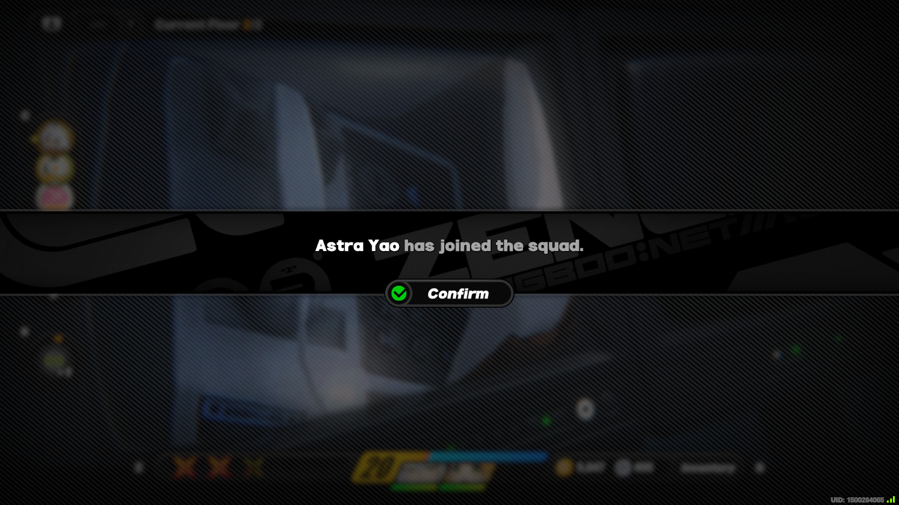

I have a bit of a tradition when it comes to my website. Whenever I hyperfixate on a game whose style I like, I will try to base my site's look on that game. My most faithful attempt at this is my [Nekoweb](https://amemoia.nekoweb.org/), which is based on [Needy Streamer Overload](https://store.steampowered.com/app/1451940/NEEDY_STREAMER_OVERLOAD/). This process is a neat way to show off my interests while also being a good exercise in design and CSS knowledge.

buh.moe's first design (dubbed v1) was based on the black and red color theme I would return to between hyperfixations. While it does look decent most of the time, I found it rather unreadable on blog posts. My font size was larger than standard and my chosen font wasn't suited for big blocks of text.

As you can probably tell by the title, I am currently hard addicted to Zenless Zone Zero, so much so that I've run out of things to do in the game. I like certain aspects of ZZZ's theme and UI design, so I decided to try to recreate part of it on my website. buh.moe needed some cleanup in its code anyway so that I can fully leverage the features Astro provides, as well as making adjustments easier in some areas.

Certain sections on my site, such as the tier list of Yakuza / Like a Dragon games, needed to be revised in a way that requires less work to update. As I'm writing this, if I want to update my Yakuza game tier list, I have to go on tiermaker, order my ranking and download the image, crop it for the website and replace the file in my project folder. This is too many steps for what is essentially adding/moving one game. Because of this, I decided to ditch the image part entirely and just recreate it in CSS and JavaScript. I decided to loosely base my implementation on [Prydwen](https://www.prydwen.gg/zenless/tier-list), a website that offers builds and tier lists for various gacha games, including ZZZ. Having this reference point made it easier to adjust my implementation for smaller screens. Now changing the tier list is as easy as editing a Markdown file.

As I mentioned, my blog needed some fixing too. Going into the redesign, I quickly realized that I would have to take a step back from ZZZ's design language. You might've noticed that the font is different, this is because I wanted to prioritize readability over visuals - the blogpost layout is partly meant to have a kind of "reader mode" vibe going on. Zenless does have big blocks of text in certain item descriptions, but the bold font doesn't do it any favors.

Admittedly, I haven't used my blog too much, because I can't bring myself to finish any of the various drafts I have lying around. Now that my blog redesign is complete, I hope to one day finish these drafts so that the prep work I did for them does not go to waste.

Below you can see a snippet of Astro code. The custom components such as `Container` and `SocialLink` are fun to work with and remove the need to repeatedly copy and paste all the HTML making up something like a `SocialLink`. `ContSection` might seem redundant at first, but it's there in case I want to add multiple sections within one `Container` and adjust their positioning. This came in handy on my specs page, where you can see two sections side by side. The full code is viewable on my [GitHub](https://github.com/amemoia/buh.moe).

I didn't exactly stick to one particular UI element for my redesign, nor did I fully adhere to ZZZ's design language. The red accent color I use is the same one I used in v1 of buh.moe, because ZZZ's yellow-green animated accent didn't really fit me. Below are some UI elements I loosely referenced for my design.

You might notice that the agent info page is the main inspiration for my `Containers`. The 2nd image depicting a system message isn't used anywhere at the time of writing except my 404 page, with the button serving as a way to go back to the main page.

Apart from all this, I don't think there's anything too notable to be found in the design. It's a bit more structured than what I was working on previously and my approach was a bit more modular. This blog post was meant to be a bit on the shorter side, but either way thank you for reading! Feel free to check out my [GitHub](https://github.com/amemoia/buh.moe) if you're interested in the inner workings of it all, there are a bunch of things I didn't mention here.